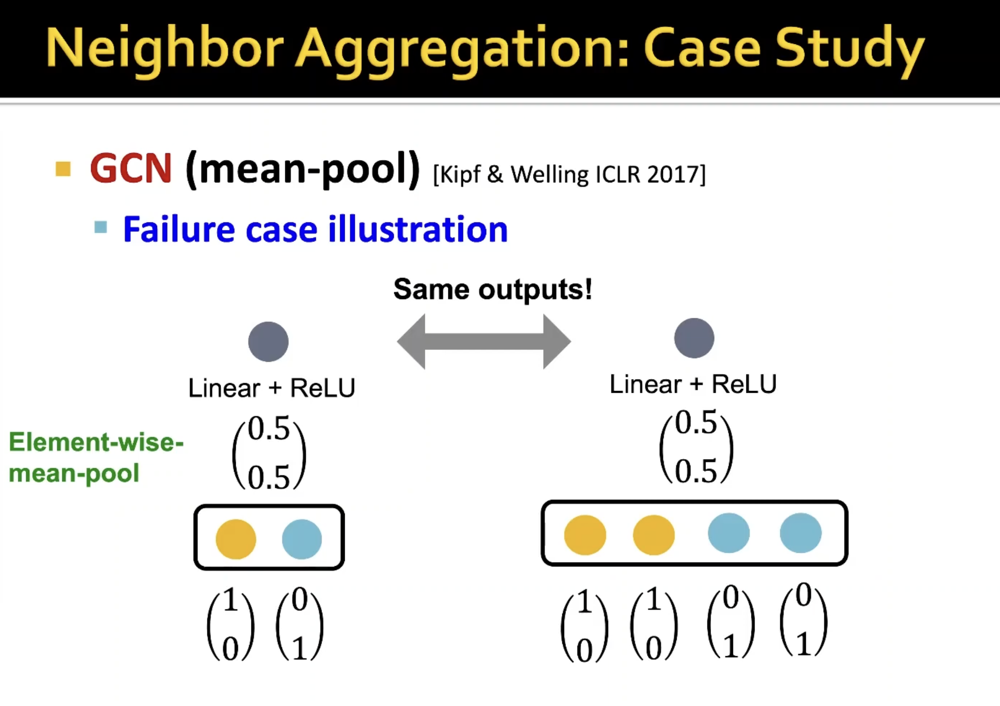

# GNN
### Concepts:
## Graphs:
   1. Bipartitle / Multipartitle graphs: for problems where we have different types of nodes
   2. ML pipeline: Handcrafted Feature extraction
      1. Node features: node degree, centrality, clustering coefficient, graphlets
      2. Graph kernel: similarity between different graphs. Graphlet Features Key idea: Count the number of different graphlets in a graph (expansive). Weisfeiler-Lehman Graph Features: 
   3. Feature engineering: remove need to handcraft features
## GNN:
   4. 
   5. 
   6. 
   7. 
   8. 
   9.  
   10. 
   11. Multi-headed attention makes attention more robust (against local minima)
   12. 
   13. 
   14. 
   15. 
   16. 
   17. 
   18. 
   19. 
   20. 
   21. 
   22. 
   23. 
   24. 
   25. 
   26. 
   27. 
   28. 
   29. 
   30. 
   31. 
   32. 
   33. 
   34. 
   35. 
   36. 
   37. 
   38. 
   39. 
   40. 
   41. 
   42. 
   43. 
   44. 
#  Heterogenious graphs
   1.  
   2.  
   3.  
   4.  
   5.  
# Deep generative model of graph (Drug discovery, material design)
   1.  
   2.  
   3.  
   4.  
   5.  
   6.  
   7.  
   8.  
   9.  
   10. 
   11. 
   12. 
   13. 
   14. 
   15. 
   16. 
   17. 
   18. 
   19. 
   20. 
   21. 
   22. 
   23. 
   24. 
### Wait, up to now it is only learning to generate "similar" graphs.
### Below, molecule generation
   1. 
   2. 
   3. 
   4. 
   5. 
   6. 
   7. 
   8. 
   9. 
   10. 
   11. 
   12. 
   13. 
   14. 
   15. 
# Limitations of GNNs
   1. 
   2. 
1.  Practices:
    1.  Batch normalization
    2.  Dropout applied to the linear layer
    3.  Parametric ReLU

